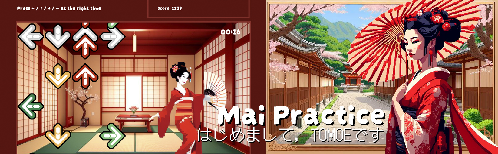

# Mai Practice

Our maiko, Tomoe, is trainning to become a geisha and she needs your help to improve her Mai dance, let's see how good you are!

## Description 

OOP game based in the classic Dance Dance Revolution

Built with web technologies (html, css & javascript)

## How to play

Press the right arrow key at the right time and increment your score

# PLAN OF ACTION

Day 1
- [x] Initial setup
- [x] Setup HTML
- [x] Create static arrows classes
- [x] Create moving arrow classes
- [x] Create movement bottom to top
- [x] Add event listeners to click arrows
- [x] Detect "collision"
- [x] Make marked arrow disappear from screen

Day 2
- [x] Try to refactor classes
- [x] Create score system
- [x] Implement score in game
- [X] DEBUG score system
- [x] Add score in end page
- [x] Complete score page

Day 3
- [x] Refactor score.js
- [x] Create Button class
- [x] Create Geisha class
- [x] Add "movement"
- [x] Create initial page
- [ ] Create difficulty levels
- [ ] Allow choosing difficulty in index.html

Day 4
- [ ] Add "movement" according to pressed arrows/points earned
- [ ] Create other types of arrows:
    - 2 at the same time
    - All four at the same time (space bar)
    - Long arrows
- [ ] Finish README.md
- [ ] Add music ?¿
